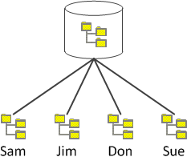
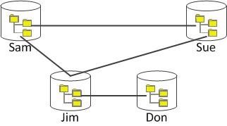
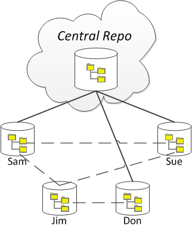
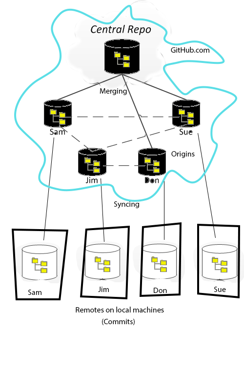

# CVCS vs DVCS

One of the earliest CVCSs is the Concurrent Versions System (CVS) dating back to the late '80s. in the early 2000s, an improved CVCS was developed that became known as Apache Subversion (SVN). Development of DVCSs dates back to the early-to-mid 2000s, with git and Mercurial emerging in 2005.(see Footnote #1)

The key difference between a *centralized* version control system and a *distributed* one is that in the CVCS there is only one repository (the central one), whereas in a DVCS there are many repositories. Developers of a CVCS access the central repository as an external or shared resource; they simply **check out** the file(s) that they need to work on (and then check them back in when they are done with them), committing changes to the central repository as they need to.

A Centralized Version Control System (CVCS)

The major benefit of using a CVCS is that all developers changes are commited to the central repo, ensuring that each developer works off of  a copy of the same source code. A downside of this approach, however, is that the developers have less flexibility to work independently; they must always keep themselves "in sync" with the central repository. Additionally, if anything goes wrong with the central repository (such as someone committing a "broken" build, or the repository becoming corrupted), then that will impact everyone.

In a DVCS, however, each developer has their own, fully-independent copy of the repository. With a DVCS system, developers are able to share their repositories with each other (a shared repository is called a **clone**). Whenever developers make changes to their source code, they commit to their own repository. This means that developers are able to work more independently of each other; they only have to share their changes with each other if they want to. If a developer wants to share their latest work with another developer's clone, they can **merge** the differences between the two repositories. (As a side benefit, since each developer has their own repository/database, if one person's repository becomes corrupt or damaged, they can just grab a clone of someone else's repository.)

A Distributed Version Control System (DVCS)

The downside of a DVCS is that since each developer is so free to work independently, the question comes up: "Who has the latest verion of everyone's contributions?" In other words, whose database represents the "truth" of all the source code for the project? A solution to this is to create another clone that everyone can regard as the "central" repository. In this approach, everyone is still working with DVCSs, but the developers regularly share their updates with the central repository (while still having the ability to share changes directly with each other). The central repository would be a clone that exists "in the cloud", such as hosted on GitHub.com, each individual's repository is a local clone stored on the individual's own computer.

A DVCS with a clone that is "in the cloud" acting as a centralized repository.

In addition to people having their own local repository, they might also be using a Pull-Request approach to managing their code, in which they could have their \*\*local\*\* repository on their computer as well as a \*\*remote\*\* repository online, with the \*\*origin\*\* being the central repository.

