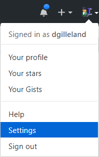
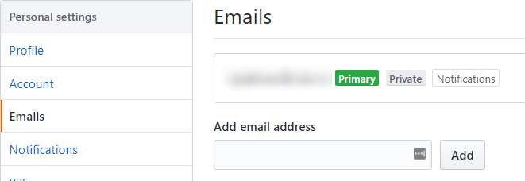

# Get a GitHub Account

You can sign up for a free GitHub account at their [signup page](https://github.com/join). Simply choose a username and a password, and tell them your email address (use your school-issued email, if you have one). Go ahead and sign up now, if you haven't already (I'll wait). Don't forget to open the the verification email from GitHub and click the link/button in that email.

## GitHub for School Work

On GitHub, you automatically have the ability to use *private* repositories for your work, which is great for your school work. If your school is part of the GitHub Education Program or if it's on their list of recognized post-secondary institutions, you're pretty much "pre-qualified" for additional features.

Even if your school doesn't participate in the GitHub Education Program, you can take advantage of special offers for students at [GitHub Education](https://education.github.com/students). To do that, simply make sure you are currently logged into GitHub on your browser and follow these steps.

1. Add a School Email to your GitHub account
    - Go to your account settings. 
    - Select **Emails** and add the email address given to you by your school. 
    - Open your email and click the verification link from GitHub.
1. Sign up for student benefits
    - Go to [GitHub Education](https://education.github.com/students)
    - Click the **Get benefits for students** button
    - Fill out the online forms
        - Identify yourself as a *student*
        - Request the discount for an *individual account*

If your school is a recognized post-secondary institution, your discount is likely to be approved in a few minutes. If not, then it will take longer, as your request will have to be reviewed by a human at GitHub.

::: danger Heads Up!
Whenever putting any school-related work that is worth marks on GitHub, make sure you have it in a **private repository** so that others can't see it. This is all part of ensuring that you are holding to principles of **Academic Integrity**. Be sure to check with your instructor to see if it's ok for you to use GitHub private repositories to store your work.
:::
