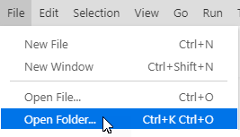
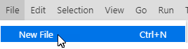
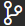
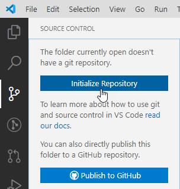
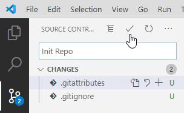

# Git Started

You've got your [software installed](../GitReady/ReadMe.md)? Great! Now what? You can try the basics of working with git by creating a simple repository (***repo***) project as your personal "training ground".

> For this walkthrough, you will need a text editor to work with the content of your repo; I'm going to assume that you have installed [Visual Studio Code](https://code.visualstudio.com).

## git Setup

Every git repo should have a couple of key files present:

- **`.gitignore`** - to identify files/folders whose content you do **not** want to track in your repository.
- **`.gitattributes`** - to smooth out the subtle differences that can occur when using text-based files on different operating systems.

The contents of the `.gitignore` file will differ gretly based upon the kinds of files you will be working with in your repo. A great location to generate your `.gitignore` file is [gitignore.io](https://gitignore.io). Likewise, you can go to [gitattributes.io](https://gitattributes.io) to generate the content for your `.gitattributes` file. For our purposes, I'll show you the minimal content you need for these two files. 

::: warning Note
Strictly speaking, you don't *have* to have these files; but you will save yourself a lot of grief if you automatically include these right away whenever you create a new repository.
:::

1. Create an empty folder on your computer as the location of your new git repo.
1. In [Visual Studio Code](https://code.visualstudio.com), choose *File &rarr; Open Folder&#8230;* and select the folder that you created.
 
    

1. Next, choose *File &rarr; New File* to create a new file and give it the name `.gitignore` (note the period in front of the file name).

    

1. Depending on your operating system (Windows vs Mac OS), enter the following in your `.gitignore` file.
    - <details><summary>Windows</summary>

        ```shell
        ### Windows ###
        # Windows thumbnail cache files
        Thumbs.db

        # Folder config file
        [Dd]esktop.ini

        # Recycle Bin used on file shares
        $RECYCLE.BIN/

        # Windows shortcuts
        *.lnk
        ```

        </details>

    - <details><summary>Mac OS</summary>

        ```shell
        ### macOS ###
        # General
        .DS_Store
        .AppleDouble
        .LSOverride

        # Icon must end with two \r
        Icon

        # Thumbnails
        ._*
        ```

        </details>

1. Once again, choose *File &rarr; New File* to create a new file and give it the name `.gitattributes` (note the period in front of the file name). Give it the following content.

    ```shell
    # Auto detect text files and perform line-feed (LF) normalization
    * text=auto
    ```

## `init` and `commit`

At this point, we have some files and a folder for our repo. It's not actually a git repository yet, however. To make it a repo we have to **initialize** the folder. Then, we can **commit** our new files as the first "snapshot" of our repository's content. You can do this in various ways, depending on the [tools](../GitReady/install.md) you've installed.

### Initializing in Visual Studio Code

1. Select the "source control" tab -  - and click on the **Initialize** button to set up your folder as a git repository.

    

1. Next, enter a short message about your first commit and click the checkmark to commit the changes.

    

## Adding a `ReadMe.md`

After starting your repository with your first commit, you can add more files. A good place to start is with a **README** file. Repositories typically include a `ReadMe.md` to let others know what the repository is all about.

1. Create a new file in your repo and call it `ReadMe.md` - This is a **Markdown** file.
1. Enter in some content using [Markdown formatting syntax](https://help.github.com/en/github/writing-on-github/basic-writing-and-formatting-syntax). Here's some sample content to get you started.

    ```markdown
    # About This Repo

    This is my first repo and I am **very excited** about learning about git repositories! I created this through the tutorial at [LearnDVCS](https://learndvcs.github.io/GitStarted/).
    ```

1. Click the source control tab -  - and commit this new file.

From this point on, it's just a matter of ["Rinse & Repeat"](https://en.wikipedia.org/wiki/Lather,_rinse,_repeat): You can edit your existing files and/or create more files, making commits whenever you want to save the latest "snapshot" of your changes.

Having a repository on your computer is just the beginning. The next step in your journey is to **publish** your repository online, so that you can share it with others and access it from anywhere.

